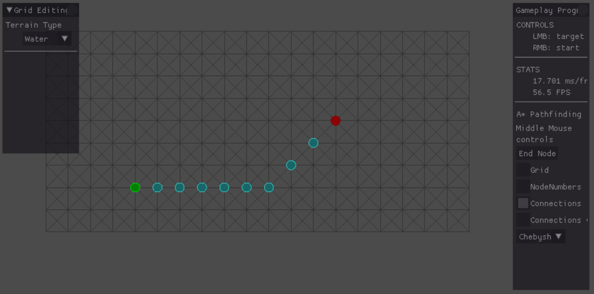
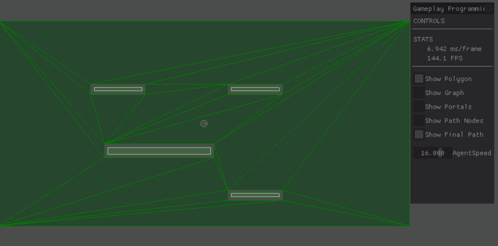
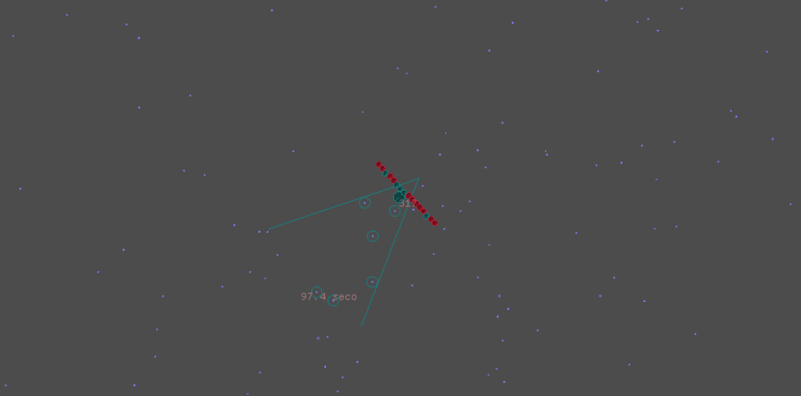

# Projects
This project contains multiple types of gameplay programming. In order to display everything to the user, this project uses SDL2 and Box2D.

In order to change the active project, (un)comment **#define**s in [AppSelector](source/projects/App_Selector.h). **Only 1 project can be active.**

Below are a couple examples of these gameplay programming projects:
## A*

[Link](source/projects/App_PathfindingAStar)

This project checks a grid to find a path available from a start node to an end node. The grid can be modified by turning tiles into water, which will block the path. Or the tile can be turned into mud, which turns the node into a more expensive node to walk through but still make it passable. 

## Flocking

[Link](source/projects/App_Steering/Combined_Behaviours)

Tons of agents are being updated every frame to modify their steering behaviour. In order to keep the framerate, this project uses Spatial Partitioning. The weight of each of the affecting steering behaviours can be modified by using sliders on the right side of the screen.

## Influence Mapping

[Link](source/projects/App_InfluenceMap)

The purpose of the game is the same as [Agar.io](https://agar.io/). One of these agents is the "Good" agent. The other agents update the influence map according to whether they are bigger or smaller than the good agent. Bigger agents color it red, telling the good agent to avoid it. Smaller agents color it blue, telling the agent to go towards it and eat it.

## Nav mesh

[Link](source/projects/App_NavMeshGraph)

Tell the agent where to go by clicking the middle mouse button. The project checks the navmesh that was generated and plans the best course using A*.

## Q Learning bot

[Link](source/projects/App_QLearning)

This QBot starts with no knowledge of the world or how it can stay alive. It learns how to find food using Q Learning. It gets rewarded every time it eats some food, punished harshly when it dies and punished a little when it passes by food without eating it. After a couple of minutes of dying, it has learned enough to stay alive.
